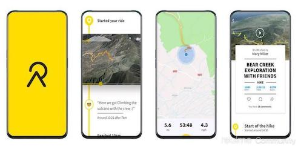
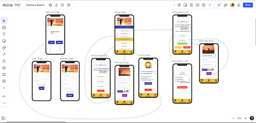

# GA Final Project: Relife

## Tech Stack

+ React Native 
+ Firebase - Realtime Database

 

## New Technologies used:
+ Expo - Software Development Kit
+ Android Emulator 
+ React Context
+ React Navigation

 

## Idea Generation / Project concept:

The idea came about with the activities tracking app known as "Relive" which I was using at the time of this project. Users are able to record and store their outdoor activities including details such as Distance, Time and Location.

 

Thus, this project named "Relife" was born. Instead of outdoor activities, users are able to save their Life Goals or any achievement they wished to pursue, with details such as Title, Description and Targeted Completion Date.

"Relife" was developed as an Android Phone app. The picture below shows the wire frame for the initial layout planned for the project.

 

## Challenges Face / Set-backs:

During development, the Android Emulator crashes or stall frequently if there are bugs involved within the code, which further lengthens the debugging time and pushes back the progress of the project. One solution that I have discovered to this problem is to close and restart the Android Emulator.

With the learning of new technologies on our own accord, much time were spent on researching, exploring documentations and Trail & Error while coding. It will be preferable if there are more time given so as to progress the project further.

 

## Things learn from doing this project
+ Improvement on React skills
+ Developent of mobile-app know-how
+ Difference between devloping Android and IOS
+ Screen responsiveness and sizes

 

## Stretch goals / Further improvements
+ Completion state for each Goals
+ Include milestones within each individual Goals
+ Deploy on google store
+ IOS 
+ Social component
